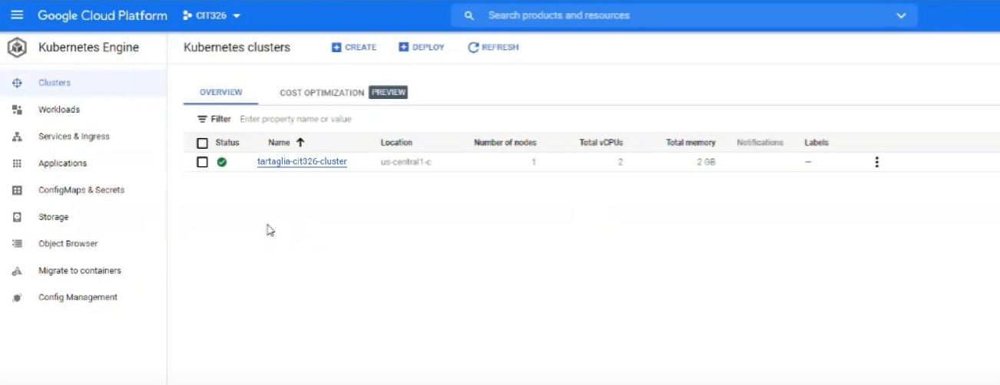
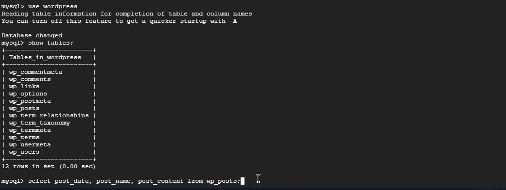
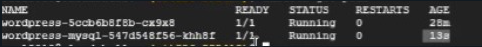

**NOTE**: Kubernetes is very hot in the industry! Having even a beginning knowledge of it can help you immensely in interviews. Do not skip this week! Also, you get to see how database containers can power a website. All you need to do is follow along.

Before you start, be sure to have watched the videos and reviewed the material provided in this week's preparation post. In the walkthrough video, you will be putting together your knowledge of containers in the cloud and actually creating a new blogging website in the process. The video walks through the tutorial found hereLinks to an external site..

Follow along with the video walkthroughLinks to an external site. and complete each step in your GCP project. REMINDER: If your project budget has run out, please do not enter a personal credit card and instead see your instructor for access to the class project.
Make and submit a short video (around 3 minutes) containing:

**SHOW 1**: Your running cluster with your last name showing 1 node with 2 GB of RAM or less.

**SHOW 2**: Your running wordpress website.

**SHOW 3**: The output from your mysql query showing a blog post you made.

**SHOW 4**: A "kubectl get pods" command showing the pods before you delete one.

**SHOW 5**: A "kubectl get pods" command showing a newly spawned pod after you delete it.

**SHOW 6**: An explanation in your own words of how kubernetes is helpful in this scenario.

When you are finished, you may want to delete your new cluster in GCP.
Optionally consider completing these tutorialsLinks to an external site. on Kubernetes.