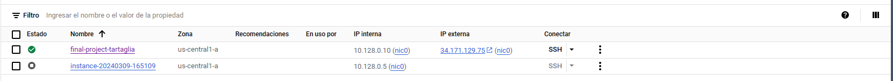
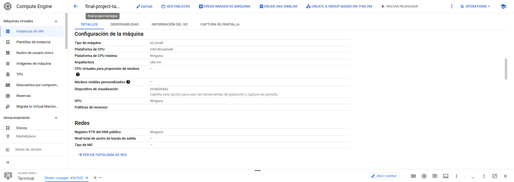

CIT 326 Final Video

This final should combine skills from various units of the course.  In the final, you will be using a new database of your choice. If you would like to have a more personal project to add as a resume item, you may create a simple database based on one of your interests (with at least 6 tables of 5 rows each). Or, you may use one of the sample databases at the bottom of this assignment. If you do not like those, you are welcome to search for another sample database using MSSQL. Whichever database you choose, it should be one that you have not used for any other assignment in this course this semester.

You will create a 10-20 minute video (or two videos adding up to this) to present your knowledge and customizations to an imagined investor who is interested in how you will run the database for this scenario.  Please create a cloud recording of your presentation to this investor. The investor isn't interested in fancy Powerpoints or graphics, but would like to see your face during the introduction and then your screen as you talk through how you would implement each of the key database solutions. Optional visual aids or outlines are permissible, but not required. We simply want you to fight your fears and set up a database that is ready to go according to the principles learned in this class! The investor would like to have you showcase database administration best practices by demonstrating each of the following in your video:

**HINT**: Helpful list of videos for the concepts covered in this final. Also review prior prep material.

----

Create a new Linux VM in Google Cloud Platform. You can use either the class project or your personal project. The name of the vm should be: ‘final-project-[yourlastname]’. If your VM name does not contain your last name, you will need to rename it to receive credit. The VM should be docker container ready with the latest image. Be sure to:

Use the ‘small’ machine type (2 GB RAM) and those suggested in week 10. Also, recommended that you do not enable “Spot” for this assignment.

Use a ‘docker run’ command to create your container on the new VM (not on your laptop). This was done in week 9 (the image should have been pulled when you created the VM here). Also, refer back to the weeks 9/10 Teams channels.

NOTE: Do NOT use the default container that comes with the new VM (starts with a ‘klt-’ prefix). You should create a new container instead before moving to step 2. This lets you choose the appropriate options in the ‘run’ command. 

**SHOW 1**:  Show or explain the steps and results of everything in step 1.	

Explain the benefits of using docker.

Move your chosen database into your new docker server in GCP. Again, see the introduction or end of this document for ideas on a database to choose. Create your database on this new cloud server using one of the below options. 

**SHOW 2**: your connection and the method you used to migrate your database.

If your chosen database has a backup file:

You will have to SSH, upload your backup, and copy it into the docker container. This was done in week 4, stepping stone 2. However, you will be doing this on the new cloud VM, not on your laptop as in week 4.

Then, establish a client connection to your new database instance (reminder video) and issue a restore command. NOTE: If you are on campus, you may need to use the visitor network depending on port.
If, instead of a backup file, your chosen database has scripted commands to create the tables and insert the data:

You should first establish a client connection to your new database instance (reminder video) as you have done previously in the course.

Then, you can run the needed commands to create your tables remotely.

Because agent jobs are on the instance level, you will not have any of your jobs from weeks 7 or 8 running inside of your new docker instance. Therefore, create a new backup job. This is to be done inside the docker instance (through your management studio connection). Use the reference section below to enable the SQL Server agent in your container if it is not already running. Also, make sure you are backing up to a location inside the container which SQL Server can write to such as the default path of var/opt/mssql/data 

**SHOW 3**: Your new database backup job inside of your docker instance and prove that all steps related to the job complete successfully.

**HINT**:

The SQL Server Agent process is required to run and schedule automated jobs. If you did not create your container using  -e 'MSSQL_AGENT_ENABLED=True', turn on the SQL Agent in your docker container by following this video or these steps: 
 
- Login to your docker container as root user: 		
docker exec -it -u root <enteryourcontainername> bash	 
 
-Enable the agent: 	
/opt/mssql/bin/mssql-conf set sqlagent.enabled true 
Ignore the informational message and type exit to close the root session.  

Restart your VM

After VM has started run this docker command to restart your container

docker start putyourcontainernamehere

Create at least two new schemas with data security as a consideration (as learned in week 3).

Transfer at least two tables of your choice into each of the new schemas (at least four total tables should be in schemas).
Issue a grant command that will give select rights on one schema to a new final_test_user login. 

Test this by logging into the database with this new login and prove that the account can only see the one schema granted and not the other (you must run select statements on tables from both schemas - one schema should work, the other select should fail). 
SHOW 4: the commands or steps used to accomplish everything in step 3.	

Explain why using schemas is a good security practice.
Create a view that combines (joins) data from two tables - one table should be in the schema from 3b and the other table should be in the schema you have not granted any access to. 

The view should be created using the same schema name as the schema you granted SELECT to in step 3b. 

Then, grant SELECT on this view to the account created in step 3b. 
Prove that this view works by logging in to the database as final_test_user and selecting from the view.

**SHOW 5**:  the commands or steps used to accomplish everything in step 4 and a quick demonstration that the user is configured correctly by logging in as final_test_user.

Explain why using views is a good security practice.

Create a new database level role (example at this link under “Listing 8” OR review where we did this in week 3 when we read chapter 12). This role should include the following privileges:
SELECT on the schema from step 3b.

SELECT on the view from step 4b.

SELECT on a table of your choice that is NOT inside the schema from 3b.

Then, create a list of all the needed DCL (grant commands) from steps a through c and assign all of these privileges to this role. 
Create another new login, final_running_buddy, and add it as a member of this new role.

SHOW 6:  the commands or steps used to accomplish everything in step 5 and a quick demonstration that the user is configured correctly by logging in as final_running_buddy.

Explain why using roles is a good security practice.

Set up column level encryption:

Choose one of the tables the final_running_buddy login should now have access to from the role membership in step 5e. 

Encrypt a column in the chosen table as done in week 5. (If you are using the Pokemon database, you may need to select columns without constraints.)

SHOW 7: that the encryption is working.

SHOW 8:  that you can backup AND then restore your database using full recovery model.

SHOW 9: Engage in some testing with a business partner (running buddy):

Help a classmate (preferably your running buddy) establish a connection to your new database using the final_running_buddy login. Ask them to post a screenshot of a successful connection in the Final Project Teams channel and their post and screenshot in your video. NOTE: They do not have to show or prove anything other than a successful connection. Please make sure you post your IP, port, and password with enough time for someone to reply to you.
Also include in YOUR video what you were able to see in your classmate’s database (for the video you could refer to your buddy as a business partner). Explore the following:

Could you find an encrypted column?

Did you have SELECT access to all tables in only ONE schema? (You should only be able to SELECT from one additional table outside the schema which was granted in step 5c.)

Did you have SELECT access to one view?

Report these findings to your classmate and include them in your video, BUT they do not have to be included in their video.

SHOW 10: Address the following in your video for the investor: 

What strategies could you explore if the company grows and you were asked to create many database copies for testing purposes or future deployments? 

What are some factors or options to consider regarding cloud hosting strategies? 

Possible databases you could choose from (or you can come up with your own database idea with at least five tables and rows in each table - feel free to use generative AI to help, but show how you did):

- Pokemon Database
- Link 1
- Link 2
- Link 3
- Link 4 - Baseball, Credit Card, and Sales Examples
- Link 5
- Link 6 - Microsoft Northwind Simple Mock Business
- Link 7
- If you find a MySQL database, you could convert it to Microsoft SQL Server using these tools.
